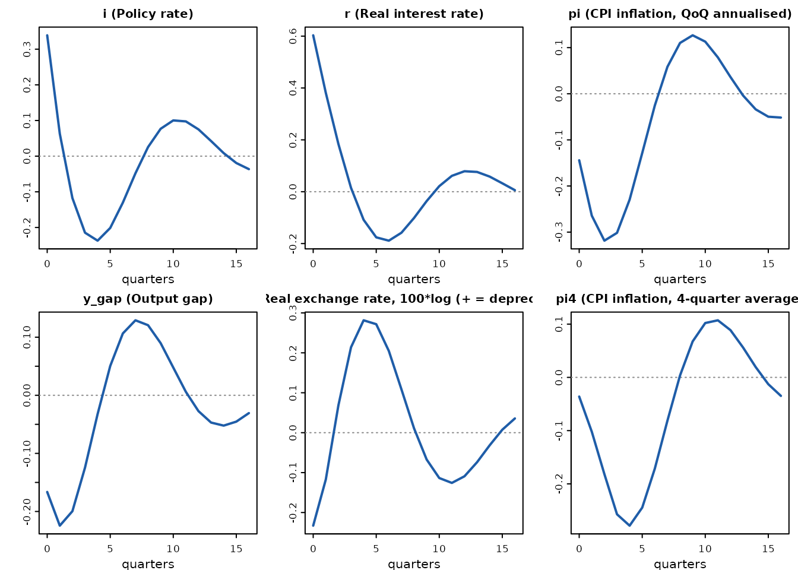
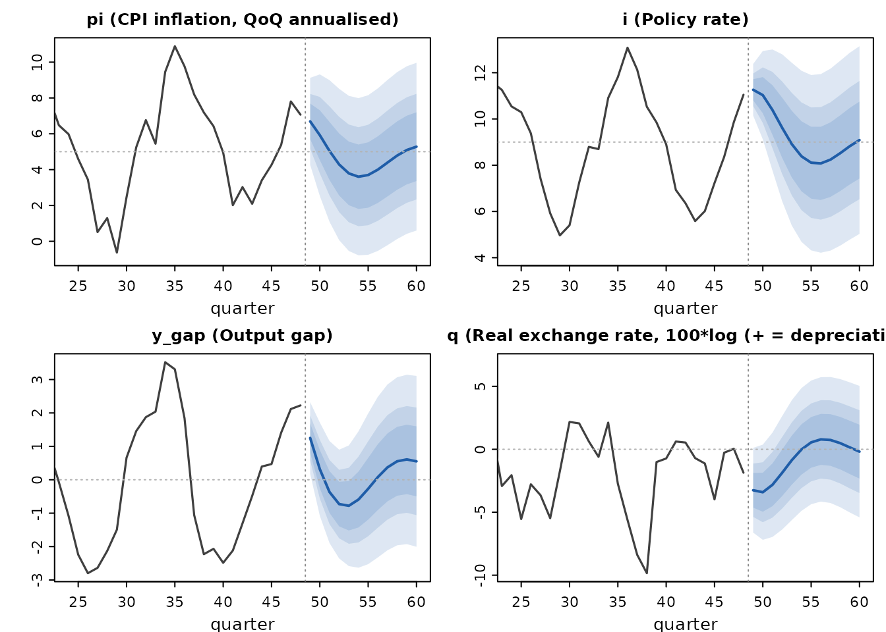
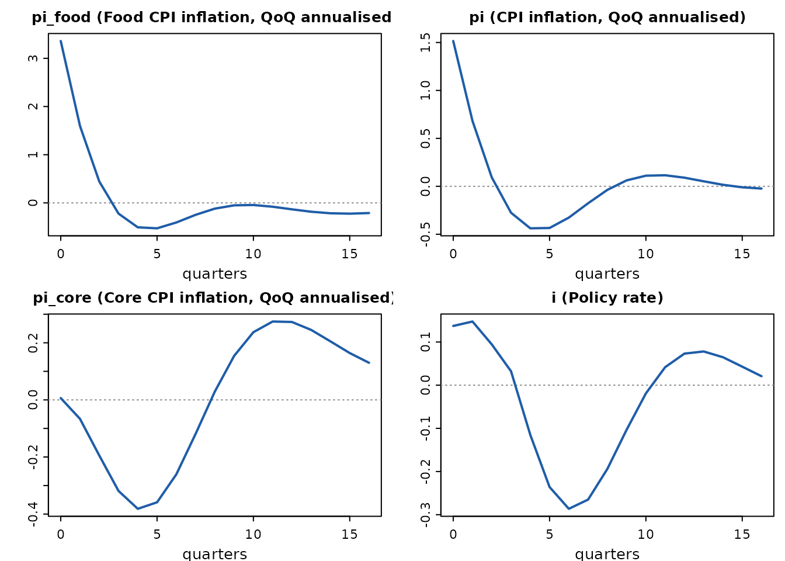
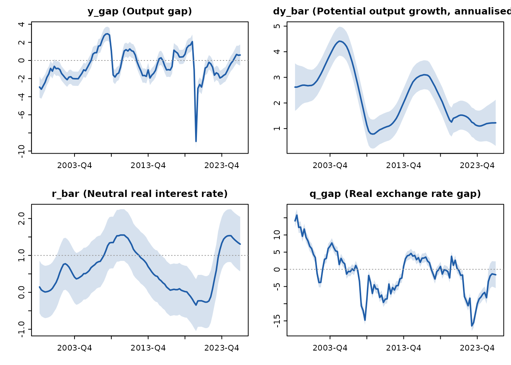
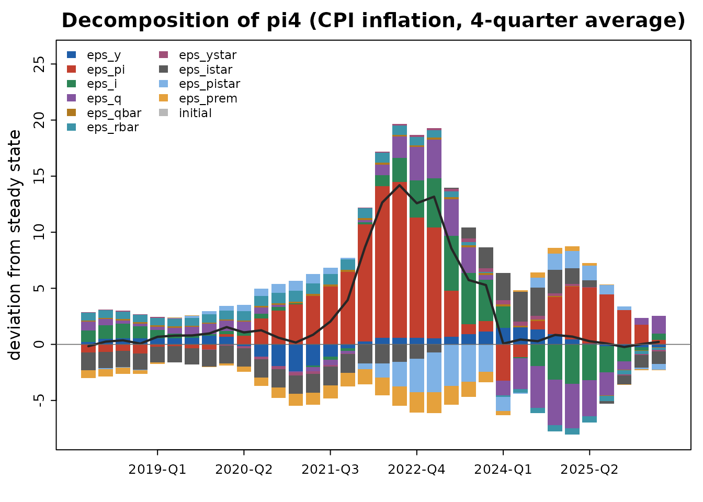
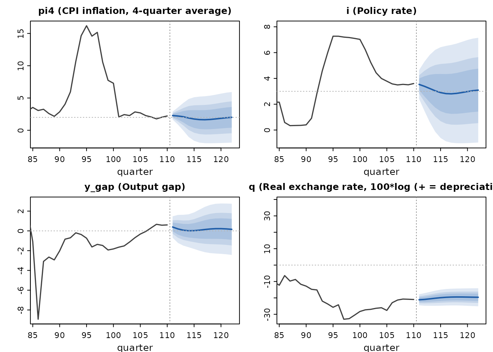
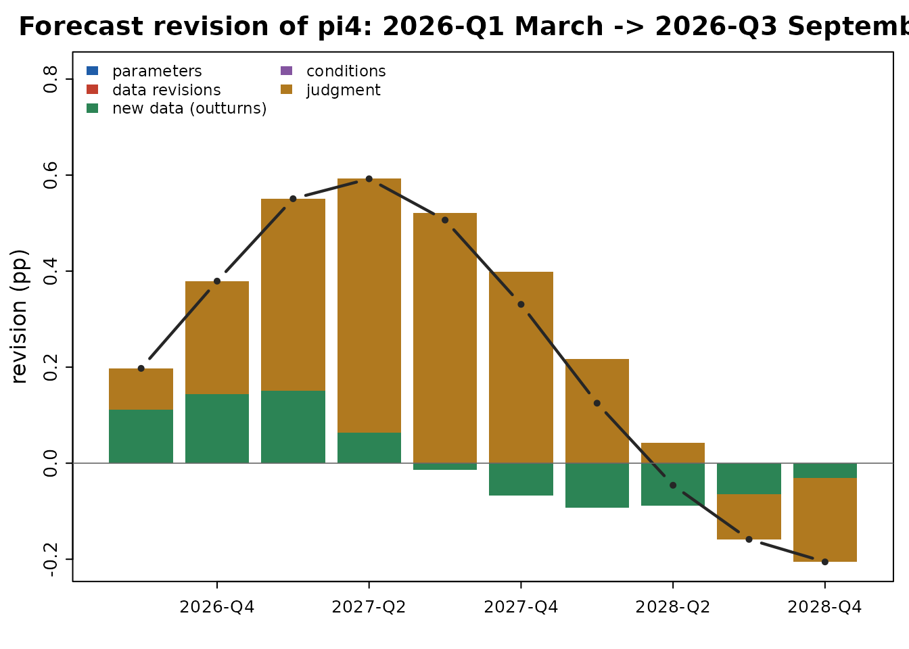

# A forecast in ten minutes: the canonical QPM in qpmR

qpmR implements the class of semi-structural quarterly projection models
(QPM) used in central-bank Forecasting and Policy Analysis Systems: an
IS curve, a hybrid Phillips curve, a forward-looking inflation-targeting
rule, and an exchange-rate block, solved under model-consistent
expectations.

## The canonical model

`qpm_template("bkl")` ships the canonical Berg–Karam–Laxton (IMF
WP/06/80–81) small open economy model with an illustrative
emerging-economy calibration — a 5 percent inflation target and a
positive country risk premium.

``` r

library(qpmR)
#> 
#> Attaching package: 'qpmR'
#> The following object is masked from 'package:stats':
#> 
#>     var
m <- qpm_template("bkl")
m
#> <qpm_model> Canonical small open economy QPM (BKL, stationary trends)
#>   17 endogenous variables - 12 shocks - 25 parameters
#>   dynamics: max lag 3, max lead 4 (auxiliary states added automatically at solve time)
#>   calibration:
#>     a1 = 0.7, a2 = 0.1, a3 = 0.2, a4 = 0.1, a5 = 0.25, b1 = 0.7, b2 = 0.25,
#>     b3 = 0.1, c1 = 0.7, c2 = 1.5, c3 = 0.5, e1 = 0.7, pi_tar = 5, istar_ss
#>     = 3, pistar_ss = 2, prem_ss = 3, qbar_ss = 0, g_ss = 3.5, rho_qbar =
#>     0.9, rho_rbar = 0.9, rho_g = 0.85, rho_ystar = 0.8, rho_istar = 0.85,
#>     rho_pistar = 0.7, rho_prem = 0.85
#>   variables: y_gap, pi, pi4, i, r, r_gap, q, q_gap, ... (see summary())
```

The policy rule responds to expected year-on-year inflation four
quarters ahead, `E(pi4[+4])`; the four-quarter identity uses lags back
to `pi[-3]`. qpmR turns those long leads and lags into auxiliary states
automatically when the model is solved.

## Solving and checking

``` r

sol <- qpm_solve(m)
sol
#> <qpm_solution> Canonical small open economy QPM (BKL, stationary trends)
#>   states: 22 (17 declared + 5 auxiliary) - shocks: 12
#>   Blanchard-Kahn: 22 stable roots = 22 predetermined states -> unique stable solution
#>   roots: largest stable 0.900, smallest unstable 1.419, 17 infinite
#>   steady state:
#>     y_gap = 0, pi = 5, pi4 = 5, i = 9, r = 4, r_gap = 0, q = 0, q_gap = 0,
#>     q_bar = 0, r_bar = 4, dy_obs = 3.5, dy_bar = 3.5, ystar_gap = 0, istar
#>     = 3, pistar = 2, rstar = 1, prem = 3
```

The Blanchard–Kahn line is a real diagnostic: an indeterminate or
explosive model refuses to solve and the error names the usual economic
cause. Violating the Taylor principle, for instance:

``` r

qpm_solve(qpm_calibrate(m, c2 = -0.5))
#> Error:
#> ! Blanchard-Kahn failure: 23 stable roots for 22 predetermined states (indeterminacy - multiple stable solutions / sunspots).
#>   A too-weak policy response is the usual cause: check that the rule satisfies the Taylor principle (long-run response of the nominal rate to inflation above one).
```

## Monetary transmission

``` r

ir <- irf(sol, shock = "eps_i", horizon = 16)
ir
#> <qpm_irf> impulse responses (deviations from steady state)
#>   shocks: eps_i (size  0.5)
#>   peak effects:
#>  shock  variable    peak quarter
#>  eps_i    dy_obs -0.6655       0
#>  eps_i         r  0.6032       0
#>  eps_i     r_gap  0.6032       0
#>  eps_i         i  0.3389       0
#>  eps_i        pi -0.3185       2
#>  eps_i         q  0.2815       4
#>  eps_i     q_gap  0.2815       4
#>  eps_i       pi4 -0.2785       4
#>  eps_i     y_gap -0.2244       1
#>  eps_i    dy_bar  0.0000       0
#>  eps_i     istar  0.0000       0
#>  eps_i    pistar  0.0000       0
#>  eps_i      prem  0.0000       0
#>  eps_i     q_bar  0.0000       0
#>  eps_i     r_bar  0.0000       0
#>  eps_i     rstar  0.0000       0
#>  eps_i ystar_gap  0.0000       0
plot(ir, vars = c("i", "r", "pi", "y_gap", "q", "pi4"))
```



A policy tightening raises the real rate, opens a negative output gap,
appreciates the currency on impact (UIP), and produces the hump-shaped
disinflation with a mild rebound as policy later eases below neutral —
the standard QPM transmission story.

## History and forecast

Until the Kalman filter arrives in 0.2, initial states come from
simulation:

``` r

histq <- simulate(sol, nsim = 48, seed = 7, burn = 20)
fc <- qpm_forecast(sol, from = histq, horizon = 12)
fc
#> <qpm_forecast> Canonical small open economy QPM (BKL, stationary trends) - 12 quarters ahead (h1 ... h12)
#>   mean (90% band) at h = 1, 4, 8, 12:
#>     y_gap      1.25 (0.18, 2.32)  -0.73 (-2.36,  0.9)  0.08 (-2.33, 2.48)  0.55 (-2.01, 3.11)
#>     pi         6.69 (4.26, 9.12)  4.29 (0.06, 8.51)     4 (-0.54, 8.53)  5.28 ( 0.6, 9.96)
#>     pi4        6.74 (6.13, 7.34)  5.49 (2.54, 8.44)  3.77 (0.08, 7.46)  4.89 (0.97, 8.81)
#>     i          11.3 (10.1, 12.4)  9.62 (6.44, 12.8)  8.08 (4.21, 11.9)  9.09 (5.03, 13.2)
#>     r          5.34 (3.62, 7.06)  5.83 (3.58, 8.08)  3.69 (0.46, 6.91)  3.75 (0.35, 7.14)
#>     r_gap      0.58 (-1.14,  2.3)  1.28 (-0.97, 3.52)  -0.68 (-3.92, 2.56)  -0.49 (-3.91, 2.93)
#>     q          -3.25 (-6.62, 0.11)  -1.87 (-6.38, 2.64)  0.79 (-4.16, 5.73)  -0.19 (-5.41, 5.04)
#>     q_gap      -3.42 (-6.8, -0.05)  -1.99 (-6.47, 2.48)   0.7 (-4.17, 5.58)  -0.24 (-5.39, 4.91)
#>     q_bar      0.17 (-0.32, 0.66)  0.12 (-0.73, 0.98)  0.08 (-0.94,  1.1)  0.05 (-1.03, 1.14)
#>     r_bar      4.76 (4.43, 5.09)  4.55 (3.98, 5.12)  4.36 (3.68, 5.04)  4.24 (3.51, 4.96)
#>     dy_obs     -0.37 (-4.97, 4.24)  2.07 (-3.46,  7.6)  4.91 (-1.12, 10.9)  3.28 (-3.12, 9.68)
#>     dy_bar     3.53 ( 3.2, 3.86)  3.52 (2.99, 4.05)  3.51 (2.91, 4.11)  3.51 (2.89, 4.12)
#>     ystar_gap  0.48 (-0.01, 0.97)  0.25 (-0.5,    1)   0.1 (-0.71, 0.91)  0.04 (-0.78, 0.86)
#>     istar      2.16 (1.67, 2.66)  2.49 (1.69, 3.28)  2.73 (1.83, 3.63)  2.86 (1.93, 3.79)
#>     pistar     2.42 ( 1.6, 3.24)  2.14 (1.03, 3.26)  2.03 (0.88, 3.18)  2.01 (0.86, 3.16)
#>     rstar      -0.13 (-0.89, 0.63)  0.38 (-0.73,  1.5)  0.71 (-0.5, 1.92)  0.85 (-0.37, 2.08)
#>     prem       4.24 (3.42, 5.07)  3.76 (2.43, 5.09)   3.4 ( 1.9,  4.9)  3.21 (1.66, 4.75)
plot(fc, vars = c("pi", "i", "y_gap", "q"))
```



The fan bands are analytic, from the forecast-error variance recursion
`V_h = P V_{h-1} P' + Q S Q'`.

## Specification checks

``` r

qpm_lint(m)
#> <qpm_lint>
#>   v 17 equations for 17 variables
#>   v every declared shock appears in an equation
#>   v all calibrated parameters inside documented ranges
#>   v solves: unique stable solution (Blanchard-Kahn satisfied); largest
#>       stable root 0.900
#>   v steady state exists and is unique (e.g. y_gap = 0, pi = 5, pi4 = 5)
#>   all checks passed
```

## Adapting the model to your country

Real engagements never use the canonical model unchanged. Extension
blocks make that adaptation reusable and reviewable instead of a fork.

The most common adaptation is disaggregating the CPI. Food is 30-50
percent of the basket across most of sub-Saharan Africa and South Asia,
and a single-inflation model cannot represent the policy question there
– supply shocks to food dominate headline, but policy should look
through the relative-price component:

``` r

m_food <- add_block(qpm_template("bkl"), block_food_cpi(weight = 0.45))
plot(irf(qpm_solve(m_food), shock = "eps_pifood", horizon = 16),
     vars = c("pi_food", "pi", "pi_core", "i"))
```



Food inflation jumps, headline follows scaled by the basket weight, and
core barely moves – so the policy response stays small. That is the
model saying what a good desk would say.

Exchange-rate management is the other common adaptation. One `intensity`
argument spans the regimes: zero reproduces the free float exactly,
larger values approach a peg.

``` r

peak_q <- function(m) {
  ir <- irf(qpm_solve(m), shock = "eps_prem", horizon = 12, size = 1)
  max(abs(ir$value[ir$variable == "q"]))
}
c(float   = peak_q(qpm_template("bkl")),
  managed = peak_q(add_block(qpm_template("bkl"), block_fx_intervention(1))),
  peg     = peak_q(add_block(qpm_template("bkl"), block_fx_intervention(4))))
#>      float    managed        peg 
#> 0.97426923 0.52554020 0.08260264
```

Whatever a country team changes,
[`qpm_diff()`](https://mustapha-wasseja.github.io/qpmR/reference/qpm_diff.md)
makes it reviewable:

``` r

qpm_diff(qpm_template("bkl"), m_food)
#> <qpm_model_diff>
#>   from: Canonical small open economy QPM (BKL, stationary trends)
#>   to:   Canonical small open economy QPM (BKL, stationary trends) + food CPI
#>   + variables: pi_core, pi_food, rp_food
#>   + shocks: eps_pifood
#>   + parameters: w_food, f1, f2, f3, f4
#>   + equations:
#>       pi_core ~ b1 * pi_core[-1] + (1 - b1) * E(pi_core[+1]) + b2 * y_gap + b3 * q_gap + eps_pi
#>       pi_food ~ f1 * pi_food[-1] + (1 - f1) * E(pi[+1]) + f2 * y_gap + f3 * q_gap - f4 * rp_food[-1] + eps_pifood
#>       rp_food ~ rp_food[-1] + (pi_food - pi_core)/4
#>   ~ equations changed:
#>       - pi ~ b1 * pi[-1] + (1 - b1) * E(pi[+1]) + b2 * y_gap + b3 * q_gap + eps_pi
#>       + pi ~ w_food * pi_food + (1 - w_food) * pi_core
```

## Real data: Czechia

qpmR ships `czechia`, a quarterly dataset from 1996 in the model’s units
(see
[`?czechia`](https://mustapha-wasseja.github.io/qpmR/reference/czechia.md)).
With `trends = "rw"` the equilibrium real exchange rate and potential
growth become random walks — the model then has unit roots and
[`qpm_filter()`](https://mustapha-wasseja.github.io/qpmR/reference/qpm_filter.md)
switches to diffuse initialization automatically.

``` r

mcz <- qpm_calibrate(qpm_template("bkl", trends = "rw"),
                     pi_tar = 2, istar_ss = 2, pistar_ss = 2,
                     prem_ss = 1, a5 = 0.4)
cz <- czechia[czechia$period >= "1999",
              c("period", "pi4", "i", "q", "dy_obs", "istar", "pistar")]
fit <- qpm_filter(mcz, cz)
fit
#> <qpm_filtration> Canonical small open economy QPM (BKL, rw trends)
#>   periods 1999-Q1-2026-Q2 (110) - observables: pi4, i, q, dy_obs, istar, pistar - missing: 12 of 660
#>   log-likelihood: -1948.04 (approximate diffuse init, 2 unit roots)
#>   innovation diagnostics: Ljung-Box min p = 0.00 (q) - autocorrelated innovations, check specification
#>   outliers (|std innov| > 3): 48; largest: period 2023-Q1 pi4 (+16.9 sd)
#>   latent states estimated: y_gap, pi, r, r_gap, q_gap, q_bar, r_bar, dy_bar, ...
```

The smoothed latent states reproduce the known history — the pre-GFC
boom, the 2009 and 2013 recessions, the COVID crater, the trend real
appreciation of the koruna, and the post-GFC fall in potential growth:

``` r

plot(fit, vars = c("y_gap", "dy_bar", "r_bar", "q_gap"))
```



Historical shock decomposition of the 2021-23 inflation wave:

``` r

dec <- qpm_decompose(fit)
plot(dec, var = "pi4", periods = (fit$n_obs - 33):fit$n_obs)
```



And a forecast from the smoothed end-of-sample state:

``` r

fc <- qpm_forecast(qpm_solve(mcz), from = fit, horizon = 12)
plot(fc, vars = c("pi4", "i", "y_gap", "q"))
```



Note the honesty of the diagnostics on real data: the Ljung-Box test
flags autocorrelated exchange-rate innovations (the driftless `q_bar`
random walk absorbs the appreciation trend through its shocks), and the
2022-23 inflation surprises show up as large outliers. That is the model
asking for judgment and recalibration — which is what 0.3 is for.

## Policy analysis: conditions, judgment, rounds

A forecast becomes policy analysis when you can impose assumptions on
it.
[`qpm_condition()`](https://mustapha-wasseja.github.io/qpmR/reference/qpm_condition.md)
inverts the model for the shocks behind any assumed path – with an
explicit `anticipated` switch, because an announced rate path and a
sequence of surprises are different economics:

``` r

base <- qpm_forecast(qpm_solve(mcz), from = fit, horizon = 12)
hold <- qpm_condition(base,
                      i = stats::setNames(rep(3.5, 4), base$periods[1:4]),
                      anticipated = TRUE, instruments = "eps_i")
hold
#> <qpm_forecast> Canonical small open economy QPM (BKL, rw trends) - 12 quarters ahead (2026-Q3 ... 2029-Q2)
#>   conditions: 4 on i (anticipated; instruments: eps_i)
#>   implied shocks, max |sd|: eps_i 0.68
#>   mean (90% band) at h = 1, 4, 8, 12:
#>     y_gap      0.47 (-0.69, 1.64)  0.12 (-1.67, 1.91)  0.24 (-1.66, 2.13)  0 (-2.34, 2.34)
#>     pi         2.32 (0.28, 4.37)  2.03 (0.07, 3.99)  2.21 (-1.57, 5.98)  2.02 (-2.94, 6.99)
#>     pi4        2.31 ( 1.8, 2.82)  2.16 (0.73, 3.58)  2.13 (0.12, 4.13)  2.12 (-2.4, 6.64)
#>     i           3.5 ( 3.5,  3.5)   3.5 ( 3.5,  3.5)  3.14 (-1.47, 7.75)  3.14 (-2.27, 8.54)
#>     r           1.3 (-1.16, 3.77)  1.46 (-0.85, 3.77)  0.93 (-1.34, 3.21)  1.18 (-2.35, 4.71)
#>     r_gap      0.03 (-2.44, 2.49)  0.26 (-2.07, 2.58)  -0.2 (-2.49, 2.09)  0.09 (-3.48, 3.67)
#>     q          -20.9 (-25.7, -16.2)  -20.2 (-25.5, -14.9)  -19.7 (-25.6, -13.8)  -19.7 (-24.6, -14.9)
#>     q_gap      -1.56 (-6.25, 3.14)  -0.77 (  -6, 4.46)  -0.31 (-6.06, 5.43)  -0.32 (-4.91, 4.27)
#>     q_bar      -19.4 (-19.9, -18.9)  -19.4 (-20.4, -18.4)  -19.4 (-20.8,  -18)  -19.4 (-21.1, -17.7)
#>     r_bar      1.28 (0.95,  1.6)   1.2 (0.63, 1.77)  1.13 (0.45, 1.81)  1.09 (0.36, 1.81)
#>     dy_obs     0.72 (-4.22, 5.66)   0.9 (-4.54, 6.34)  1.19 (-4.34, 6.73)     1 (-5.12, 7.13)
#>     dy_bar     1.22 ( 0.9, 1.55)  1.22 (0.57, 1.88)  1.22 (0.29, 2.16)  1.22 (0.09, 2.36)
#>     ystar_gap  0.45 (-0.04, 0.95)  0.23 (-0.52, 0.98)   0.1 (-0.71,  0.9)  0.04 (-0.78, 0.86)
#>     istar      2.05 (1.55, 2.54)  2.03 (1.24, 2.82)  2.01 (1.12, 2.91)  2.01 (1.09, 2.93)
#>     pistar     2.64 (1.82, 3.46)  2.22 (1.11, 3.33)  2.05 (0.92, 3.19)  2.01 (0.87, 3.16)
#>     rstar      -0.4 (-1.52, 0.71)  -0.13 (-1.49, 1.24)  -0.02 (-1.45, 1.41)  0 (-1.22, 1.22)
#>     prem       1.17 (0.35, 1.99)   1.1 (-0.19,  2.4)  1.05 (-0.4, 2.51)  1.03 (-0.49, 2.55)
```

Judgment is a logged, auditable operation rather than a spreadsheet
tweak:

``` r

judged <- add_judgment(base, pi4 = stats::setNames(0.4, base$periods[3]),
                       author = "prices desk",
                       rationale = "announced energy-tariff increase")
judgment_log(judged)
#> <judgment ledger> 1 entry
#>  id time             author      variable period  add   target
#>  1  2026-08-26 20:51 prices desk pi4      2027-Q1 +0.40 2.5   
#>  rationale                       
#>  announced energy-tariff increase
#>   implied shocks, max |sd|: eps_y 0.04, eps_pi 0.20, eps_i 0.04, eps_q 0.09, eps_qbar 0.01, eps_rbar 0.01, eps_ystar 0.01, eps_istar 0.03, eps_pistar 0.02, eps_prem 0.05
```

A forecast round archives the whole pipeline – model, calibration, data
vintage, filtration, conditioned forecast – as one replayable object,
and
[`compare_rounds()`](https://mustapha-wasseja.github.io/qpmR/reference/compare_rounds.md)
answers the question every chief economist asks: *why did the forecast
move?*

``` r

czA <- cz[cz$period <= "2025-Q4", ]
rA <- qpm_round("2026-Q1 March", mcz, czA, horizon = 12)
rB <- qpm_round("2026-Q3 September", mcz, cz, horizon = 12)
rB <- add_judgment(rB, pi4 = c("2027-Q1" = 0.4), author = "prices desk",
                   rationale = "announced energy-tariff increase")
rev <- compare_rounds(rA, rB, variables = c("pi4", "i", "y_gap"))
print(rev, variables = "pi4", periods = "2027-Q1")
#> <qpm_revision> 2026-Q1 March -> 2026-Q3 September
#>   pi4 at 2027-Q1: 1.95 -> 2.50  (+0.55)
#>      +0.00  parameters
#>      +0.00  data revisions
#>      +0.15  new data (outturns)
#>      +0.00  conditions
#>      +0.40  judgment
#>   (+ 9 more periods; print(x, variables=, periods=) or plot(x, variable=))
plot(rev, variable = "pi4")
```



The contributions telescope, so they sum to the total revision exactly,
and the decomposition endpoints are verified against the archived
rounds.
[`save_round()`](https://mustapha-wasseja.github.io/qpmR/reference/save_round.md)
/
[`load_round()`](https://mustapha-wasseja.github.io/qpmR/reference/save_round.md)
/
[`list_rounds()`](https://mustapha-wasseja.github.io/qpmR/reference/save_round.md)
manage the on-disk round store, with human-readable CSV sidecars for
auditing without R.

## Closing the round: audit and report

An archived round is only useful if it still reproduces.
[`verify_round()`](https://mustapha-wasseja.github.io/qpmR/reference/verify_round.md)
re-runs the whole pipeline from the round’s own contents — model,
calibration, data vintage, conditions and judgment — and checks the
published numbers against the archive:

``` r

verify_round(rB)
#> <qpm_verification> 2026-Q3 September
#>   archived under qpmR 1.0.0.9000, verified under 1.0.0.9000
#>   re-ran the pipeline with 0 conditions and 1 judgment entry
#>   v forecast reproduces exactly (largest deviation 0)
```

A round that no longer reproduces is a finding, not a mystery: the
report names the largest deviation, the variables responsible, and any
qpmR version drift. Loaded from a store, it also checks the CSV sidecars
against the object, so a hand-edited audit trail shows up.

The round then becomes the deliverables a policy meeting runs on — the
standard chart pack and the monetary policy report, which carries the
executive summary, the fan charts, the gaps, the shock decomposition,
the judgment ledger and the revision against the previous round:

``` r

chart_pack(rB, "chart_pack.pdf")
qpm_report(rB, "mpr.html", compare_to = rA)
```

[`qpm_report()`](https://mustapha-wasseja.github.io/qpmR/reference/qpm_report.md)
always writes the `.Rmd` source next to its output, on the principle
that institutions replace the template’s *text*, not its plumbing.

## Where this is going

Estimation — priors, posterior sampling on the filter likelihood,
identification diagnostics, marginal likelihoods, and posterior fan
charts — is covered in
[`vignette("qpmR-estimation")`](https://mustapha-wasseja.github.io/qpmR/articles/qpmR-estimation.md).
Next on the roadmap: the full FPAS reporting workflow (Quarto report
templates, chart packs). See the README.
